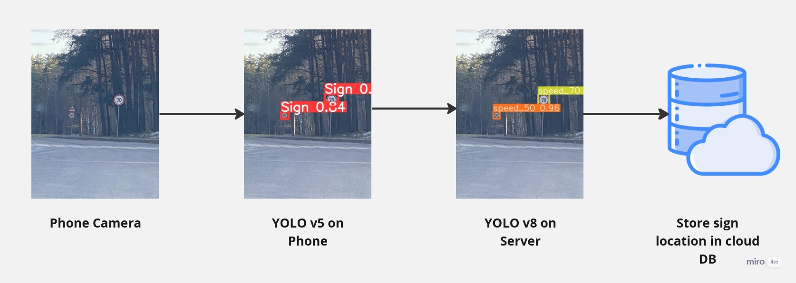

This project provides a solution to help drivers using a mobile app by notifying them of traffic lights, speed bumps, and radars before reaching them on the road and Informing the driver if he exceeds the safe distance between him and the cars in front of him. 

This aims to solve this problem by providing drivers with real-time information about these obstacles and allowing them to plan their routes accordingly. The application uses advanced algorithms and machine learning techniques to analyze real-time traffic data and notify drivers about traffic lights, speed bumps, and radars on their planned routes.

## Detection Process
We used a Multi-Level classification technique to identify road objects such as cars, traffic lights, and speed bumps, in real-time. This ensures optimal performance on mobile devices by employing as few resources as possible while getting the desired results.

We've fine-tuned both the YOLO v5 and v8 versions to meet our specific requirements. The on-device model recognizes signs and cars and sends them to our server for additional analysis. The results are saved in our database once they have been discovered. 

We have created an additional model for identifying sudden actions.

## Data Gathering
We manually acquired data from many sources using bash scripts that download data, filter it, and alter its labels to our standard labels.

After training and applying the sudden actions detection model, it consistently detected sudden actions but not routine activities.

To address this, we created a separate application that collects and formats gyroscope and accelerometer data for conventional driving circumstances.

This additional data is combined with the existing dataset to create a more comprehensive and balanced training dataset.

### Promo Video

## Project Functionalities
### 1. Notify the driver before he reaches a speed bump, radar, or traffic light.
It is important for drivers to be aware of their surroundings and to be prepared for any potential dangers.
Drivers will be notified before they reach a speed bump, traffic light, or radar. 
So that, they can slow down and adjust their speed accordingly.

### 2. Inform the driver if he exceeds the speed limit.
If a driver exceeds the speed limit, they should be notified in order to help them become more aware of their driving habits.

### 3. Inform the driver when exceeding the safe distance.
Notifying the driver if they exceed the safe distance between vehicles is important for a number of reasons. 
It helps to ensure that the driver is aware of their surroundings and can take appropriate action to avoid a potential collision. 

### 4. Warn the driver if he overtakes dangerously.

### 5. Give the driver an overall summary of his driving.
A brief overview of their driving habits, behaviors, and performance.
 
This can include information such as average  speed, number of miles driven, any traffic violations, and overall driving efficiency. 

### 6. Show stored Geolocation of signs.
Adding Geolocation of signs  could be done in two ways:

- Admin adds signs manually.
- Model detects signs and stores them in the database.
- User reports signs manually.
- Rank for each sign  (admin = 10*users).

### 7. Communication between user and app

Our application incorporates Speech-to-Text functionality to enable hands-free interaction for users.

By utilizing advanced speech recognition technology, users can easily respond to application prompts and commands without the need for manual input.

This feature enhances user convenience and safety by allowing them to interact with the application while keeping their hands on the steering wheel and eyes on the road.

The Speech-to-Text integration ensures seamless communication between the user and the application, making it more user-friendly and accessible.

Also supports Text-To-Speech to inform the user with notifications about new events, updates, or messages in an app.

